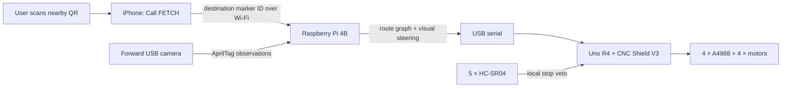

# FETCH

FETCH is a hackathon-scale autonomous mecanum robot. A user scans the QR code at the wall checkpoint nearest them, taps **Call FETCH**, and the robot follows a pre-mapped checkpoint graph while its forward camera reads AprilTags. Five ultrasonic sensors stop motion around obstacles.

This repository contains the final checkpoint-navigation build. Older TF-Luna, BLE/UWB homing, phone-sees-robot, compass, battery-monitor, and coordinate-SLAM designs are not part of this configuration.

> This is a controlled-demo prototype, not a certified public-space autonomous system. The software and static engineering checks pass, but the physical commissioning and 20-minute rehearsal in the build manual are mandatory.

## Start here

- [Final build manual](docs/FINAL_BUILD_MANUAL.md) — exact parts, wiring, Vref setup, commissioning, and steps 1–106
- [JK42HS40-1704-13A motor audit](docs/JK42HS40-1704-13A.md) — manufacturer specifications and current-limit values
- `./verify_all.sh` — firmware, Pi, iOS, wiring, navigation, CAD, and marker checks

## How it works



The phone does not need to see the robot. The QR identifies the user's destination. The robot already knows which checkpoint it starts at, computes a path through `topo_map.json`, and keeps visually steering toward the next AprilTag until it reaches the requested checkpoint.

## Final hardware

- Raspberry Pi 4B, microSD, and forward-facing UVC USB webcam
- Arduino Uno R4 and CNC Shield V3.00
- 4 × A4988 with heatsinks and a cooling fan
- 4 × JK42HS40-1704-13A NEMA 17 motors
- 4 × 80 mm mecanum wheels
- 5 × HC-SR04 ultrasonic sensors
- One 11.1 V 2000 mAh SM2P battery installed; the second pack is a disconnected spare
- 7.5 A ATC/ATO inline fuse, master switch, 5.1 V/5 A buck, and 470 µF/25 V motor-rail capacitor
- QR/AprilTag checkpoint posters: `markers/fetch_CHECKPOINTS_PRINT_ME.pdf`

No TF-Luna, logic-level shifter, BNO08x, or battery monitor is required.

## Authoritative wiring

### Power

```text
Battery + -> 7.5 A fuse (within 10 cm) -> master switch -> positive distribution
Battery - ----------------------------------------------> ground distribution

Positive/ground distribution -> CNC Shield motor + / -
Positive/ground distribution -> 5.1 V/5 A buck -> Raspberry Pi USB-C
Raspberry Pi USB-A -> data-capable USB cable -> Uno R4 USB-C
470 uF/25 V capacitor -> across CNC motor input, correct polarity
```

Use a mating SM2P pigtail instead of cutting the battery lead when possible. Never connect both battery packs together. Leave the shield's motor-supply-to-Arduino jumper off.

### Motors and drivers

| CNC socket | Shield pins | Motor position |
|---|---|---|
| X | D2 step / D5 direction | Front-left |
| Y | D3 step / D6 direction | Front-right |
| Z | D4 step / D7 direction | Rear-left |
| A | D12 step / D13 direction | Rear-right |

Set the A socket to independent D12/D13, not clone mode. Install MS1 and MS2 and leave MS3 open on all four axes for 1/4 microstepping. With motors unplugged, set Vref from the actual sense-resistor marking:

| Driver marking | Vref for 1.275 A target |
|---|---:|
| R050 | 0.510 V |
| R100 | 1.020 V |

Stop if the marking is unreadable or R200; do not guess.

### Ultrasonic sensors

All sensor VCC leads go to the shield 5 V rail and all grounds go to shield GND. End-stop headers provide signal and ground, not sensor VCC.

| Sensor | Direction | TRIG | ECHO |
|---|---:|---|---|
| US1 | 0° front | D9 | D10 |
| US2 | 75° left-front | D11 | A0 |
| US3 | 145° left-rear | A1 | A2 |
| US4 | 215° right-rear | A3 | D0 |
| US5 | 285° right-front | D1 | A4 |

Leave A5 unconnected. D0/D1 cannot be used for other serial hardware in this build; Pi-to-Uno communication uses USB.

## Software layout

```text
firmware/fetch_drive/       Uno drive control, sonar veto, watchdog
pi/topo_server.py           Camera + route server used by checkpoint mode
pi/topo_nav.py              Route graph and visual steering policy
ios/FetchCheckpoint.swift   Scan/checkpoint/call iPhone interface
markers/                    Final printable QR + AprilTag checkpoint posters
cad/                        Robot enclosure and sensor-pod models
sim/verify.py               Engineering invariants
tools/                      Wiring, motor, marker, and manual audits
```

## Verify and run

```bash
./verify_all.sh

python3 tools/make_topo_map.py \
  --edges 0-1,1-2,2-3 \
  --output topo_map.json

python3 pi/topo_nav.py --map topo_map.json --check

python3 pi/topo_server.py \
  --map topo_map.json \
  --camera 0 \
  --serial /dev/ttyACM0 \
  --start-zone 0
```

Set `PI_BASE` in `ios/FetchCheckpoint.swift` to the Pi's LAN address, keep the iPhone and Pi on the same Wi-Fi, and physically place the robot at the declared start zone. Follow the full manual before any floor run.

## Fixed operating limits

| Setting | Value |
|---|---:|
| Firmware speed ceiling | 250 mm/s |
| Automatic approach | 200 mm/s |
| Slew | 500 mm/s² |
| Front stop | 60 cm |
| Checkpoint arrival | 65 cm |
| Side/rear stop | 35 cm |
| Rotation stop | 20 cm |
| Command watchdog | 500 ms |

The go/no-go rule is simple: do not run for judges until all four motors, all five ultrasonic sensors, every camera route edge, cancellation, Wi-Fi loss, obstacle stops, the master switch, and a full 20-minute battery rehearsal have passed.
