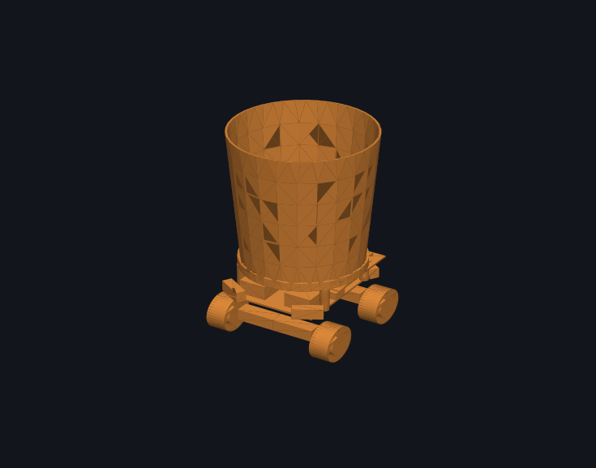
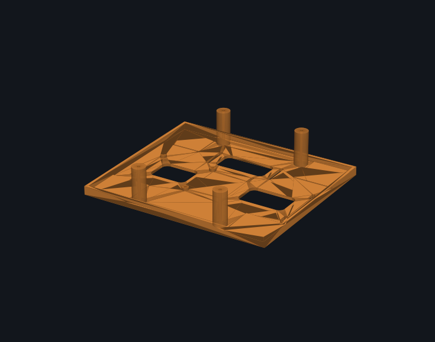
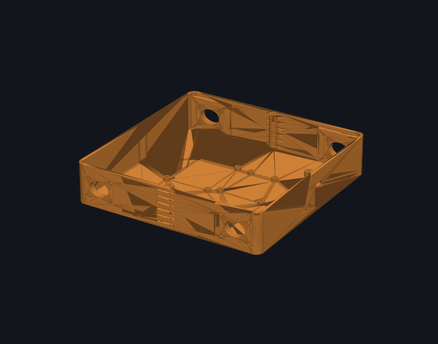
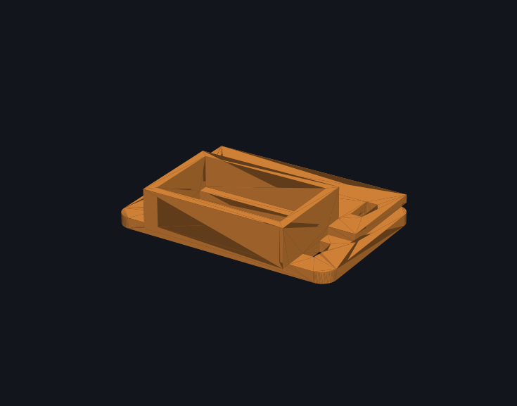
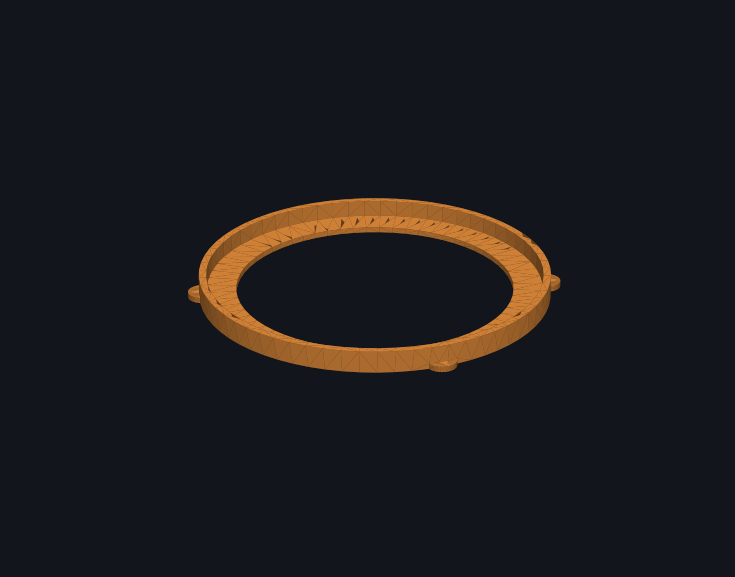
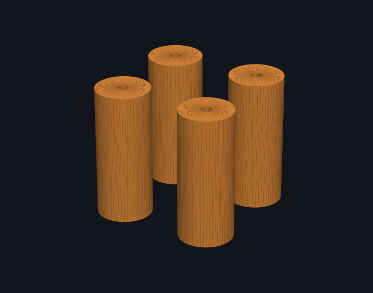
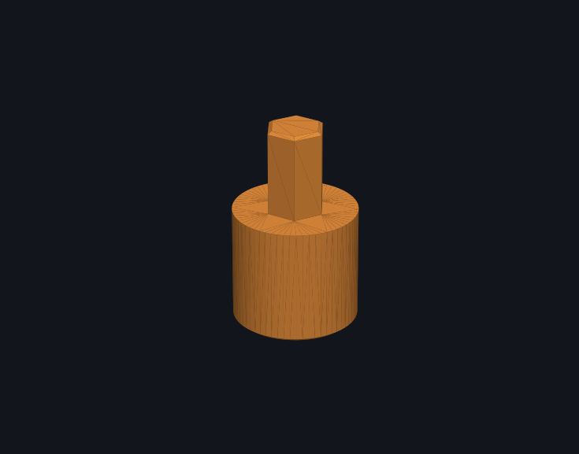

# FETCH

A four wheel mecanum robot that carries a trash can around an art gallery. You
teach it where the art pieces are by driving it there once. After that it
returns to any of them on its own, and visitors can call it over by pointing a
phone at the AprilTag next to them.

It runs with no encoders, no IMU, no lidar, and no map of the room.



## How it navigates without odometry

The robot cannot know its position in the room. Wheel step counts would drift
immediately because mecanum wheels slip sideways as part of how they work.

Instead it stores a graph of places and the driving between them.

```
home ──teach──> tag 0 ──teach──> tag 1 ──teach──> tag 2
     <──────────        <──────────       <──────────
```

Nodes are places. Edges are the exact commands given while driving there,
recorded as `(vx, vy, w, dt)`. Pressing "mark 0" saves everything driven since
the last mark as the edge into node 0.

Edges work in both directions. Driving an edge backwards means replaying its
segments in reverse order with every velocity negated. This is a true inverse
because the robot is holonomic, and the net displacement of forward plus
backward is exactly zero. A car could not do this.

Routing uses Dijkstra weighted by recorded driving seconds rather than hop
count. Counting hops would pick one 40 second edge over two 5 second edges.

## Two web interfaces

Both are served by one Python process on the Pi over a Cloudflare tunnel, so
they work on any network including venue WiFi that blocks device to device
traffic.

**Operator page.** Drive with on screen controls or arrow keys. Set home, mark
checkpoints, send the robot to any of them. Live sonar readings, camera feed,
and a motor rate slider for tuning stepper resonance.

**User page at `/user`.** A visitor opens it on a phone, points the camera at an
AprilTag, and the page reports which art piece they are standing at. One button
sends the robot from wherever it is to them. Tag detection runs on the Pi, so
the phone needs no app and no install.

## Hardware

| Part | Detail |
|---|---|
| Compute | Raspberry Pi 4, own 5 V power bank |
| Motion | Arduino Uno R4 WiFi, CNC Shield V3, 4x A4988 |
| Motors | 4x NEMA 17 with 60 mm mecanum wheels |
| Sensing | USB webcam, 3x HC-SR04 front facing |
| Power | 3S LiPo for motors, switched separately from the Pi |

Motor pin map:

| Corner | Socket | Step | Dir | Polarity |
|---|---|---|---|---|
| Front left | X | D2 | D5 | +1 |
| Front right | Y | D3 | D6 | +1 |
| Rear left | Z | D4 | D7 | -1 |
| Rear right | A | D12 | A0 | +1 |

Rear right takes its direction signal from A0 on a jumper.

## Safety

Ordered by precedence. The two firmware guards keep working if WiFi, the
tunnel, or the Pi goes away mid run.

1. STOP button in the GUI
2. Touching manual controls cancels any autonomous trip
3. 500 ms communication watchdog, in firmware
4. Forward motion refused under 25 cm front clearance, in firmware
5. Obstacle pause during route replay, which resumes rather than skipping

A sonar reading of `0` means no echo, not an obstacle. Both the firmware veto
and the replay loop require a reading that is close and plausible, at least
3 cm, so an unplugged sensor cannot freeze a run.

## Layout

```
firmware/fetch_final/   Arduino sketch: kinematics, sonar, safety
pi/gui.py               web server, both pages, all endpoints
pi/checkpoints.py       the place graph, teaching, Dijkstra routing
pi/navigator.py         replays a planned chain of edges
pi/drive.py             serial to the Uno, keepalive, auto reconnect
pi/fetch_auto.py        camera and AprilTag detection
markers/                printable tag36h11 tags 0 to 4
cad/                    STEP and STL for every printed part
bringup.sh              start everything and print both URLs
```

## Serial protocol

The Uno accepts single line commands at 115200 baud.

```
v <vx> <vy> <w>   velocity, -100 to 100 each
m <corner> <spd>  drive one motor, 0=FL 1=FR 2=RL 3=RR
k <steps/s>       full scale wheel rate, for tuning noise
g <0|1>           disarm or arm the front veto
s                 stop
?                 report state
```

It reports `us f=52 lf=110 rf=0` at about 11 Hz, in centimetres.

## Running it

```bash
./bringup.sh
```

Starts the tunnel, waits for the Pi, verifies both pages return 200, and prints
the URLs. Services on the Pi start themselves at boot.

## Printed parts

| | | |
|---|---|---|
|  |  |  |
| Deck | Trash can box | Sensor pod |
|  |  |  |
| Can crown | Crown legs | 5 mm to hex shaft coupler |

## Known limits

The robot's belief about its own position is not measured. It updates only when
a trip completes, so an aborted trip never claims an arrival, but carrying the
robot by hand makes the belief stale. Press Set HOME to correct it.

Replay is open loop, so each edge adds a few percent of distance error plus
heading drift, and it compounds along a chain. Teaching checkpoints every couple
of metres keeps each edge short.

The robot has no spatial model, so it cannot invent a shortcut between two
checkpoints that happen to be near each other. Drive that edge once and it
becomes available in both directions.
