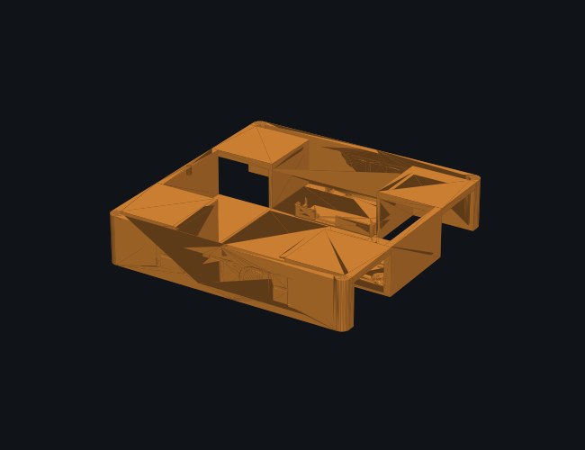
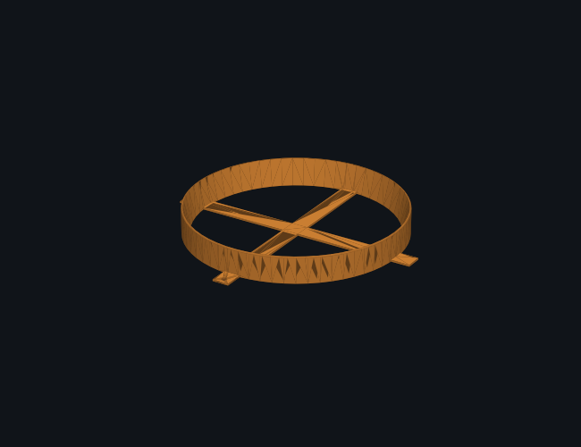
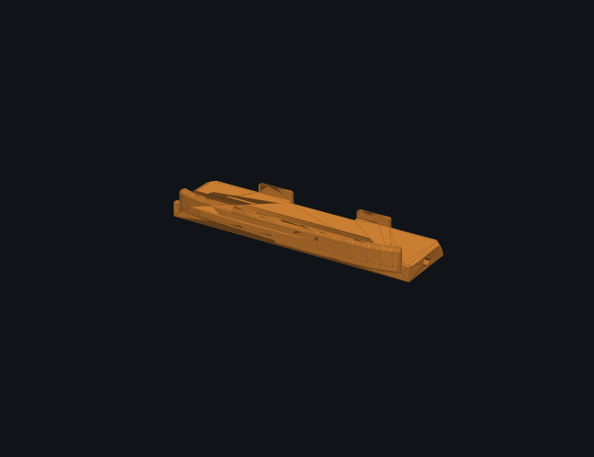
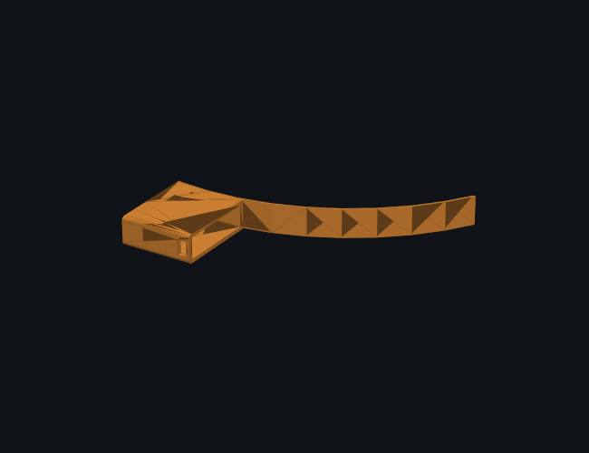
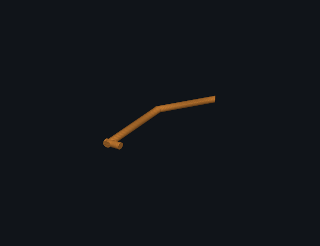

# FETCH

FETCH is a mecanum-wheeled robot that carries a trash can around a gallery and
comes to you when you call it. We built it in eight hours at a hackathon, and
it won first place.

You teach it a room by driving it around once. Park it on a spot, press a
button to name that spot, drive to the next one, name that. From then on it
drives to any of them on its own. A visitor calls it by opening a web page and
pointing their phone at the AprilTag beside them.

There is no lidar on this robot. No encoders, no IMU, and no map of the room.
That was not a design goal, it was the parts budget, and working around it is
most of what makes the project interesting.



## The navigation problem

A robot with no encoders cannot know where it is. You might think you could
count motor steps and integrate, but mecanum wheels slip sideways as part of
how they generate lateral motion, so those counts diverge from reality within
a metre or two.

So we do not store positions. We store driving.

```
home ──teach──> tag 0 ──teach──> tag 1 ──teach──> tag 2
     <──────────        <──────────       <──────────
```

Nodes are places. Edges are the actual velocity commands you gave while
driving between them, saved as `(vx, vy, w, dt)` tuples. Press "mark 0" and
everything you drove since the last mark becomes the edge into node 0.

The nice part is that edges run both ways for free. To drive an edge backwards
you replay its segments in reverse order with every velocity negated. That is
a true inverse here, and we checked: net displacement of forward plus backward
comes out to exactly zero. It only works because the robot is holonomic. Try
this on a car and you will drive into a wall.

Route planning is Dijkstra weighted by recorded driving seconds. We started
with breadth-first search over hop count and it kept choosing one long edge
over two short ones, which looked broken to anyone watching.

## Calling the robot

Open `/user` on a phone, point the camera at a tag, press the button. The page
sends camera frames to the Pi, which runs the AprilTag detector and answers
with which checkpoint you are standing at. The robot then drives to you from
wherever it happens to be.

Detection runs on the Pi rather than in the browser, which is why this works
on any phone with no app and no install. The phone only needs a camera and a
fetch call.

## Hardware

| Part | What we used |
|---|---|
| Compute | Raspberry Pi 4 on its own 5 V power bank |
| Motion | Arduino Uno R4 WiFi, CNC Shield V3, four A4988 drivers |
| Motors | Four NEMA 17 steppers, 60 mm mecanum wheels |
| Sensing | USB webcam, three front-facing HC-SR04 |
| Power | 3S LiPo for motors, switched separately from the Pi |

The Pi and the motors run on separate supplies on purpose. Killing motor power
mid-demo should not take down the computer, the web server, and your only way
of stopping the robot.

Motor wiring:

| Corner | Socket | Step | Dir | Polarity |
|---|---|---|---|---|
| Front left | X | D2 | D5 | +1 |
| Front right | Y | D3 | D6 | +1 |
| Rear left | Z | D4 | D7 | -1 |
| Rear right | A | D12 | A0 | +1 |

Rear right takes its direction signal from A0 on a jumper wire rather than the
usual pin.

## Printed parts

Five parts, about five hours of printing all together, which ran while we
wrote firmware. The chassis is the long pole by a wide margin, so print that
one first and do everything else while it runs.

| | Part | Size (mm) | Print time | Filament |
|---|---|---|---|---|
|  | Master chassis | 210 x 210 x 55 | 3 h 51 m | 221 cm3 |
|  | Trash can base lid | 214 x 214 x 30 | 47 m | 48 cm3 |
|  | C290 enclosure to servo | 93 x 28 x 15 | 11 m | 9 cm3 |
|  | Servo enclosure ring | 106 x 88 x 16 | 10 m | 8 cm3 |
|  | Supporting pole | 24 x 81 x 5 | 1 m | 1 cm3 |

Times are what our printers actually did at 0.3 mm layers and 15 percent
infill. A slower machine will take considerably longer, so slice before you
commit to a schedule.

## How much of this was fixed with a knife

Every part was printed during the hackathon. Nothing came off a plate before
the clock started, which meant the CAD had to be finished in the same hours as
the firmware, and it shows.

Roughly 80 percent of the parts needed cutting or modifying by hand before
they would fit. Holes drilled out, walls trimmed, mounting faces filed back.
Print quality was poor at the speed we ran, so tolerances that would have been
fine on a careful print were not close enough to assemble.

Three of the four chassis joints needed super glue and repair work to hold.
The robot that won is held together partly with adhesive and partly with
patience.

If you are rebuilding this, print the chassis first and dry fit it before
committing to the rest. Most of what we cut by hand was avoidable with one
test print and an hour of tolerance work, which is exactly the hour we did not
have.

## Software

Three languages, each where it belongs.

Step timing lives on the Arduino in C++, because steppers need pulses at
precise intervals and Linux is not a real-time OS. A scheduler hiccup on the
Pi would stutter the motors. The Arduino does nothing else, so it never
hiccups.

Everything else is Python on the Pi: the web server, the checkpoint graph, the
route planner, and the vision. The web pages are HTML, CSS and JavaScript
embedded directly in `gui.py` as string constants.

The server is `http.server` from the Python standard library. No Flask, no
FastAPI, no build step. The whole thing is one file you copy with `scp`, and
on a fresh Pi it runs immediately. During a hackathon where the Pi got power
cycled repeatedly, that mattered more than any framework feature would have.

It has to be threaded because the camera stream at `/camera.mjpg` never
returns. It holds the connection open and writes JPEG frames forever, so a
single-threaded server would block there and stop answering everything else.
Five threads run in one process: HTTP handlers, the serial reader, a keepalive,
the camera, and the navigator.

One process rather than several, because only one process can hold
`/dev/ttyACM0` and only one can hold `/dev/video0`. Splitting autonomy into a
separate script would have meant stopping the GUI to demo, which is not a demo.

## Serial protocol

The Pi talks to the Arduino in plain text at 115200 baud.

```
v <vx> <vy> <w>   velocity, -100 to 100 each
m <corner> <spd>  drive one motor alone, 0=FL 1=FR 2=RL 3=RR
k <steps/s>       full scale wheel rate, for tuning stepper noise
g <0|1>           arm or disarm the front obstacle veto
s                 stop
?                 report state
```

Text rather than binary so you can debug it by opening a serial monitor and
typing. That saved us an hour when the rear right motor was misbehaving.

The Arduino reports `us f=52 lf=110 rf=0` in centimetres about eleven times a
second.

## Safety

Two of these live in firmware, which matters more than it sounds. The Pi
resends the current velocity every 100 ms, and if the Arduino goes 500 ms
without hearing anything it stops the motors. WiFi dropping, the browser
closing, the tunnel dying, or the Pi losing power all produce the same result:
the robot stops within half a second. The guarantee does not depend on the
network, because it is enforced by the side that is not on the network.

In precedence order:

1. The STOP button
2. Touching manual controls, which cancels any autonomous trip
3. The 500 ms communication watchdog, in firmware
4. Forward motion refused under 25 cm of front clearance, in firmware
5. Obstacle pause during route replay, which resumes rather than skipping

A sonar reading of `0` means no echo, not an obstacle. Both the firmware veto
and the replay loop require a reading that is close and physically plausible,
at least 3 cm, so a disconnected sensor cannot freeze the robot in place. We
learned this the hard way when a rail glitch pinned the front sensor at 5 cm
and forward motion stopped working entirely.

## Repository layout

```
firmware/fetch_final/   Arduino sketch: kinematics, sonar, safety
pi/gui.py               web server, both pages, all endpoints
pi/checkpoints.py       place graph, teaching, Dijkstra routing
pi/navigator.py         replays a planned chain of edges
pi/drive.py             serial to the Arduino, keepalive, auto reconnect
pi/fetch_auto.py        camera and AprilTag detection
cad/                    the five printed parts
markers/                printable tag36h11 tags, 0 through 4
bringup.sh              starts everything and prints both URLs
```

## Running it

```bash
./bringup.sh
```

This waits for the Pi, checks both services, reads the current tunnel URL, and
confirms both pages return 200 before printing anything. The services start
themselves at boot, so after a power cycle you only need this to find out what
URL the tunnel picked.

Print `markers/apriltags/apriltags_0-4.pdf` at 100 percent scale. Do not let
the print dialog scale it to fit the page, because the tag size is how the
robot judges distance.

## What it does not do

Replay is open loop, so every edge adds a few percent of distance error plus
some heading drift, and it compounds along a chain. The fix is teaching
checkpoints every couple of metres so no single edge is long enough to matter.

The robot has no spatial model, so it cannot work out that two checkpoints are
near each other unless you drove between them. If it insists on routing from 1
back through home to reach 0, drive it from 1 to 0 once and mark it. That edge
then exists in both directions.

Position is belief, not measurement. It updates when a trip completes, so an
aborted trip never claims an arrival, but picking the robot up and moving it
makes the belief wrong. Press Set HOME to correct it.

It does not plan around a moving crowd. It stops for obstacles and resumes.
That is honest for a supervised indoor space, which is what it was built for.
